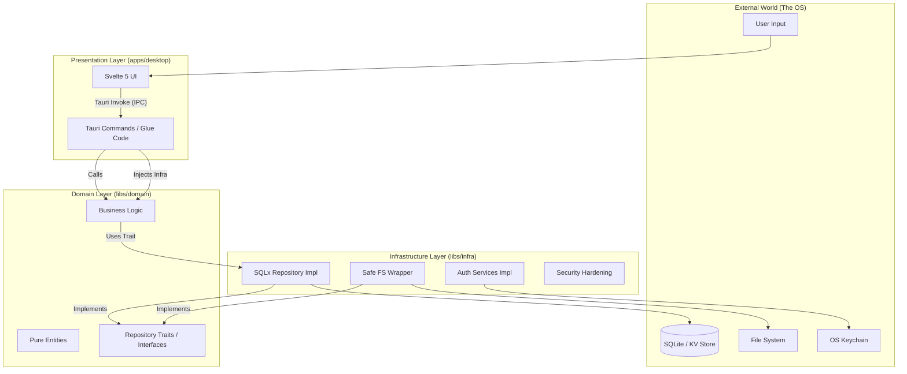

# 🏗️ Aroeira Architecture Guide

This document provides a comprehensive technical deep-dive into the **Aroeira Template**. It details the design decisions, the modular monolith structure, the security enforcement layers, and the data flow that makes this template "impossible to break."

## 1. High-Level Design Philosophy

Aroeira enforces a **Modular Monolith** architecture using **Vertical Slices** within a Rust Workspace. Unlike traditional layered architectures (Controller -> Service -> Dao), Aroeira emphasizes domain purity and strict boundary enforcement using Rust's compilation unit capabilities.

### The Core Tenets

1.  **The Dependency Rule**: Source code dependencies can only point **inwards**. `libs/domain` knows nothing about the database, the file system, or the Tauri frontend.
2.  **Dependency Inversion**: High-level modules (Domain) do not depend on low-level modules (Infra). Both depend on abstractions (Traits defined in Domain).
3.  **Compile-Time Safety**: We leverage the Rust type system to make invalid states unrepresentable (e.g., using NewTypes and Enums for domain states).
4.  **Zero-Trust Local Environment**: We treat the local operating system as a hostile environment. We actively harden against symlink attacks, race conditions, and unauthorized memory access.

## 2. System Overview Diagram

The following Mermaid diagram illustrates the module interactions and the "Onion" architecture approach:



## 3. The Workspace Structure

The repository is organized as a Cargo Workspace with three primary members. This physical separation prevents accidental coupling.

```text
/
├── apps/
│   └── desktop/           # Main Application (Tauri v2 + Svelte 5)
├── libs/
│   ├── domain/            # Pure Business Logic
│   └── infra/             # Concrete Implementations (DB, Adapters)
├── Cargo.toml             # Workspace Configuration
└── docker-compose.yml     # Local Infrastructure (Postgres)
```

### 3.1. `libs/domain` (The Inner Core)

This is the heart of the application. It is strictly **framework-agnostic**. It does not know that Tauri exists, nor does it know that SQLx is used.

- **Responsibility**: Defines the business rules, entities, errors, and **Interfaces (Traits)** that the infrastructure must implement.
- **Modules**: Organized by feature (Vertical Slices).
  - `src/modules/auth/`: Contains `User` structs, `AuthError` enums, and `AuthRepository` traits.
  - `src/modules/notes/`: Contains logic for note management, validation, and encryption rules.
- **Testing**: Pure unit tests. No I/O allowed here.

**Example Domain Entity:**

```rust
// libs/domain/src/modules/player/entity.rs
pub struct Player {
    pub id: Uuid,
    pub name: String,
    pub stats: PlayerStats,
}

// Interface (Port)
#[async_trait]
pub trait PlayerRepository: Send + Sync {
    async fn save(&self, player: &Player) -> Result<(), DomainError>;
}
```

### 3.2. `libs/infra` (The Mechanism)

This layer adapts the outside world to the domain. It is the **only** place where:

1.  `unsafe` code is generally permitted (for syscalls/FFI).
2.  Database queries (SQL) are written.
3.  File System operations occur.

- **Database**: Uses `sqlx` (SQLite) to implement the repositories defined in Domain.
- **Security**: Implementations for Windows ACLs, POSIX permissions, and Keychain access (using `keyring` crate).
- **Services**: Email providers, Logging, and Telemetry adapters.

### 3.3. `apps/desktop` (The Composition Root)

This is the entry point (the "Main"). Its primary job is **Dependency Injection**.

- **Tauri Commands**: These act as the "Controllers". They receive JSON from the frontend, deserialize it, instantiate the correct Domain Service, inject the Infra implementation, and return a Result.
- **Frontend (Svelte 5)**: The view layer. It communicates with Rust solely through typed Tauri Commands.
- **State Management**: Holds the `AppState` (managed by Tauri), which contains the connection pools and service singletons.

## 4. Security Architecture

Aroeira distinguishes itself through "Security by Design" rather than "Security by Patching".

### 4.1. Secure Storage Strategy

We do not store sensitive tokens (Session IDs, Refresh Tokens) in `localStorage` or plain text files.

- **Implementation**: We utilize the OS native secure storage via `libs/infra/src/services/secure_storage.rs`.
  - **macOS**: Keychain Access.
  - **Windows**: DPAPI (Data Protection API).
  - **Linux**: Secret Service API / org.freedesktop.Secrets.

### 4.2. File System Hardening

To prevent Directory Traversal and Symlink Race Conditions (TOCTOU):

- **Symlink Protection**: The `libs/infra` layer resolves paths and verifies that the final canonical path is contained strictly within the allowed application data directory _before_ performing any read/write.
- **Windows ACLs**: On Windows, we explicitly set Access Control Lists on the configuration folders to prevent other non-admin users on the same machine from reading the data.
- **Atomic Creation**: Uses `O_NOFOLLOW` (Unix) and `FILE_FLAG_OPEN_REPARSE_POINT` (Windows) during file creation to prevent hijacking.

**Security Module Diagram:**

```
┌─────────────────────────────────────────────────────┐
│              Application Layer (Tauri)              │
│  - persist_env_secret                               │
│  - get_or_create_secret_sync                        │
│  - securely_create_db_file                          │
└────────────────────┬────────────────────────────────┘
                      │
                      ▼
┌─────────────────────────────────────────────────────┐
│              Security Module (infra)                │
│  ┌───────────────────────────────────────────────┐  │
│  │         SecureFileCreator                     │  │
│  │  - Atomic file creation                       │  │
│  │  - Path validation                            │  │
│  │  - Permission hardening                       │  │
│  └───────────────────────────────────────────────┘  │
│  ┌───────────────────────────────────────────────┐  │
│  │         PathValidator                         │  │
│  │  - Path traversal detection                   │  │
│  │  - Symlink validation                         │  │
│  │  - Containment verification                   │  │
│  └───────────────────────────────────────────────┘  │
└────────────────────┬────────────────────────────────┘
                      │
                      ▼
┌─────────────────────────────────────────────────────┐
│              Operating System Layer                 │
│  - Unix: O_NOFOLLOW, syscalls                       │
│  - Windows: FILE_FLAG_OPEN_REPARSE_POINT, Win32 API │
└─────────────────────────────────────────────────────┘
```

### 4.3. Rate Limiting

To prevent brute-force attacks on local login forms:

- **Token Bucket Algorithm**: Implemented in memory within the Rust backend (10k bucket limit).
- **Context**: Rate limits are keyed by the operation type (e.g., `login_attempt`) to ensure legitimate usage isn't blocked while attacks are throttled.
- **Backoff**: Exponential backoff (capped at 30s) slows down persistent attacks.

### 4.4. Content Security Policy (CSP)

Defined in `tauri.conf.json`, we enforce a strict policy:

- `default-src: 'self'`
- `script-src`: No `unsafe-inline` allowed.
- `style-src`: Restricted to internal styles.
- **IPC Isolation**: The frontend is isolated from the backend; only specific commands are exposed.

## 5. Data Flow Example: User Login

Trace of a request from UI to Database:

1.  **Svelte (Frontend)**: User clicks "Login". Input is validated via Zod schema.
2.  **IPC Bridge**: `invoke('login_user', { email, password })` is called.
3.  **Tauri Command (`apps/desktop`)**:
    - `fn login_user(...)` intercepts the call.
    - It applies the **Rate Limiting** check immediately.
4.  **Domain Execution**:
    - The command calls `domain::modules::auth::login(email, password, &repo)`.
    - **Domain (`libs/domain`)**: Pure Rust logic. No sqlx, no file system, no network.
    - **Infrastructure (`libs/infra`)**: Implementation of Repositories (SeaORM), Services (Email, Auth), and System Adapters.
    - Password hash is verified using `Argon2`.
5.  **Response**:
    - On success: Domain returns a `User` entity.
    - Command serializes the generic User data to JSON.
    - **Crucial**: The Auth Token is **not** returned to JSON. It is saved directly to the **OS Keychain** by the backend.
6.  **UI Update**: Svelte receives "Success" and routes to Dashboard.

## 6. Frontend Architecture (Svelte 5)

The frontend is located in `apps/desktop` and follows modern Svelte 5 patterns.

- **Runes**: We use `$state` and `$derived` for local reactivity.
- **Stores**: Global application state (like User Session) is handled via Svelte Stores, but populated exclusively by backend responses.
- **Shadcn-Svelte**: UI components are "copied-in" rather than imported as a library, allowing full customization of the component code.
- **Error Handling**: All Tauri errors are intercepted by a global error handler that sanitizes the message before displaying it to the user (preventing path leakage).

## 7. Testing Strategy

The architecture is designed to be testable at 3 distinct levels:

| Level                    | Location      | Scope                                                                                           | Command                  |
| ------------------------ | ------------- | ----------------------------------------------------------------------------------------------- | ------------------------ |
| **Unit**                 | `libs/domain` | Business Logic, validation rules, state transitions. Mocks are used for repositories.           | `cargo test --lib`       |
| **Security/Integration** | `tests/*.rs`  | Verifies the "glue" and security invariants. Tests against real SQLite (in-memory) and real FS. | `cargo test --workspace` |
| **E2E**                  | `e2e/`        | Playwright tests controlling the compiled binary. Checks visual regressions and full flows.     | `npm run test:e2e`       |

## 8. Decision Records (ADR)

Significant architectural decisions are recorded in the `plans/` directory. Refer to these files for the "Why" behind specific implementations:

- **`plans/security-architecture-symlink-attack-fixes.md`**: Details the TOCTOU mitigation strategy.
- **`plans/feature_oauth2_setup.md`**: The PKCE flow implementation details.

## 9. Future Considerations

As Aroeira evolves, the following architectural boundaries must remain:

1.  **No ORM in Domain**: The Domain must never know about SQLx structs. Mapping must happen in Infra.
2.  **Native Look & Feel**: We strive to use native window decorations and OS-specific patterns where possible, handled by Tauri configuration.
3.  **Performance**: We prefer `async` Rust for I/O bound tasks (Database, Network) but synchronous operations for pure CPU computations in Domain.

---

> For detailed security checklists, refer to [`SECURITY_CHECKLIST.md`](../docs/SECURITY_CHECKLIST.md).
