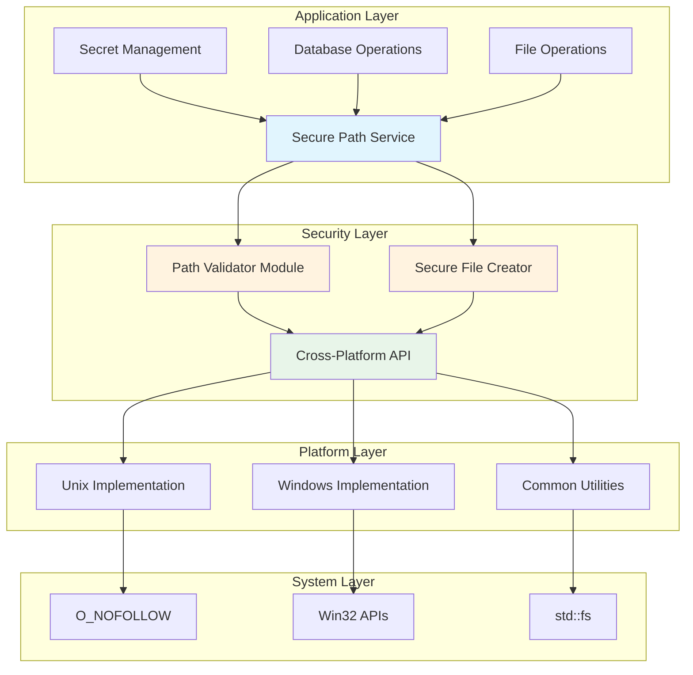
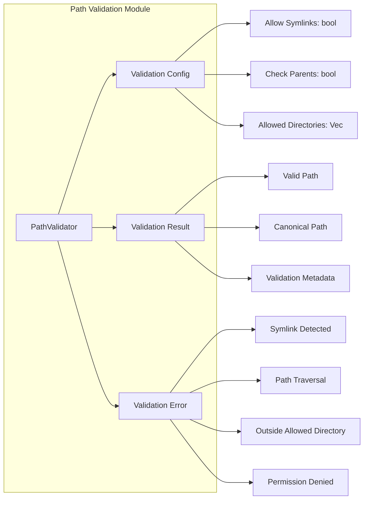
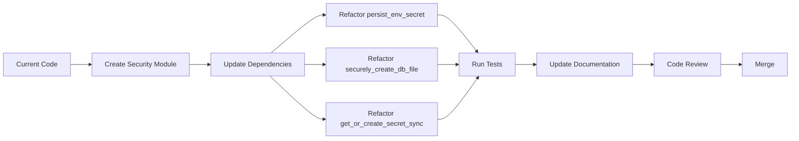
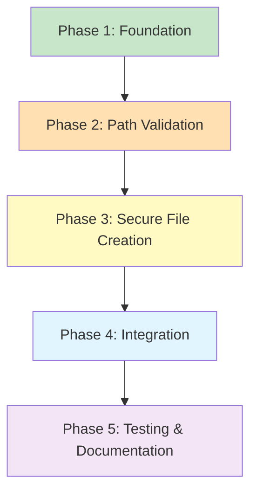

# Security Architecture: Symlink Attack Vulnerability Fixes

## Executive Summary

This document provides a comprehensive security architecture design to address symlink attack vulnerabilities identified in the PR review. The architecture provides a unified, cross-platform approach to prevent symlink attacks across all file operations in the codebase.

**Document Version:** 1.0  
**Last Updated:** 2026-01-18  
**Status:** Design Phase

---

## Table of Contents

1. [Overview](#overview)
2. [Vulnerability Analysis](#vulnerability-analysis)
3. [Architecture Design](#architecture-design)
4. [Cross-Platform Symlink Prevention Strategy](#cross-platform-symlink-prevention-strategy)
5. [Secure Path Validation Module](#secure-path-validation-module)
6. [Secure File Creation API](#secure-file-creation-api)
7. [Integration Points](#integration-points)
8. [Error Handling Strategy](#error-handling-strategy)
9. [Testing Strategy](#testing-strategy)
10. [Dependencies and External Crates](#dependencies-and-external-crates)
11. [Implementation Roadmap](#implementation-roadmap)
12. [Trade-offs and Considerations](#trade-offs-and-considerations)

---

## Overview

### Problem Statement

The codebase contains two critical symlink attack vulnerabilities:

1. **Issue 1: Symlinked Secret Write in `persist_env_secret`**
   - **Location:** [`apps/desktop/src-tauri/src/lib.rs:192-208`](../apps/desktop/src-tauri/src/lib.rs:192-208)
   - **Vulnerability:** Writes secrets without verifying `storage_path` or parent directories are not symlinks
   - **Attack Vector:** Local attacker can redirect writes to sensitive locations via symlinked directories
   - **Impact:** Exfiltration/overwrite of `JWT_SECRET`, `RATE_LIMIT_KEY`, and other sensitive key material

2. **Issue 2: Windows TOCTOU File Vulnerability**
   - **Location:** [`libs/infra/src/database/mod.rs:806-836`](../libs/infra/src/database/mod.rs:806-836)
   - **Vulnerability:** Creates file then checks for symlink afterward, creating TOCTOU window
   - **Platform:** Windows-specific (lacks atomic `O_NOFOLLOW` equivalent)
   - **Impact:** Attackers can redirect database file creation to unintended paths

### Current State Analysis

The codebase has **inconsistent symlink handling** scattered across multiple files:

| File                                                                                            | Symlink Protection                        | Status        |
| ----------------------------------------------------------------------------------------------- | ----------------------------------------- | ------------- |
| [`apps/desktop/src-tauri/src/lib.rs`](../apps/desktop/src-tauri/src/lib.rs)                     | Partial (missing in `persist_env_secret`) | ⚠️ Incomplete |
| [`libs/infra/src/database/mod.rs`](../libs/infra/src/database/mod.rs)                           | Partial (TOCTOU on Windows)               | ⚠️ Vulnerable |
| [`apps/desktop/src-tauri/src/commands/auth.rs`](../apps/desktop/src-tauri/src/commands/auth.rs) | Good (device ID handling)                 | ✅ Good       |
| [`libs/infra/src/bin/setup.rs`](../libs/infra/src/bin/setup.rs)                                 | Good (temp directory checks)              | ✅ Good       |

**Key Issues:**

- Duplicate symlink checking code across multiple locations
- Inconsistent error messages
- Missing validation in critical paths (`persist_env_secret`)
- TOCTOU vulnerability on Windows
- No unified testing strategy

### Design Goals

1. **Security First:** Prevent all symlink attacks across all platforms
2. **Cross-Platform:** Unified approach for Unix and Windows
3. **Reusable:** Single module for all symlink prevention needs
4. **Performant:** Minimal overhead for security checks
5. **Maintainable:** Clear, well-documented code
6. **Testable:** Comprehensive test coverage
7. **Fail-Safe:** Secure defaults, explicit errors

---

## Vulnerability Analysis

### Issue 1: Symlinked Secret Write

**Code Location:** [`apps/desktop/src-tauri/src/lib.rs:203-218`](../apps/desktop/src-tauri/src/lib.rs:203-218)

```rust
fn persist_env_secret(storage_path: &std::path::Path, env_secret: &str, env_var_name: &str) {
    // ... logging ...

    // VULNERABILITY: No symlink validation before writing
    if let Some(parent_dir) = storage_path.parent() {
        let _ = (|| -> Result<(), Box<dyn std::error::Error>> {
            create_secure_directory(parent_dir)?;  // Doesn't validate symlinks
            write_secret_to_file(storage_path, env_secret)?;  // Doesn't validate symlinks
            Ok(())
        })();
    }
}
```

**Attack Scenario:**

1. Attacker creates symlink: `/app/config/secrets/jwt_secret` → `/etc/passwd`
2. Application calls `persist_env_secret` with environment variable `JWT_SECRET`
3. Secret is written to `/etc/passwd`, potentially overwriting system files
4. Attacker can exfiltrate secrets by redirecting to attacker-controlled location

**Impact:** CRITICAL

- Data exfiltration
- System file corruption
- Privilege escalation potential

### Issue 2: Windows TOCTOU File Vulnerability

**Code Location:** [`libs/infra/src/database/mod.rs:786-816`](../libs/infra/src/database/mod.rs:786-816)

```rust
#[cfg(windows)]
{
    // VULNERABILITY: Create file first, then check for symlink
    // This creates a TOCTOU (Time-of-Check-Time-of-Use) window
    let mut options = std::fs::OpenOptions::new();
    options.write(true).create_new(true);

    match options.open(absolute_file) {
        Ok(file) => {
            drop(file); // Close file before checking

            // TOCTOU WINDOW: Attacker can replace file with symlink here
            let metadata = std::fs::symlink_metadata(absolute_file)?;
            if metadata.file_type().is_symlink() {
                let _ = std::fs::remove_file(absolute_file);
                return Err(anyhow::anyhow!("SQLite fallback path must not be a symlink"));
            }
            Ok(())
        }
        // ...
    }
}
```

**Attack Scenario:**

1. Application creates file at `/app/data/database.db`
2. Attacker races to replace `/app/data/database.db` with symlink to `/etc/passwd`
3. Application checks if file is symlink (TOCTOU window)
4. If check passes, attacker has redirected database writes to sensitive location

**Impact:** CRITICAL

- Arbitrary file writes
- Data corruption
- Privilege escalation

---

## Architecture Design

### High-Level Architecture



### Component Overview

| Component                 | Responsibility                 | Interface                  |
| ------------------------- | ------------------------------ | -------------------------- |
| **Secure Path Service**   | Centralized symlink prevention | `SecurePathService` trait  |
| **Path Validator Module** | Path validation logic          | `PathValidator` struct     |
| **Secure File Creator**   | Atomic file creation           | `SecureFileCreator` struct |
| **Cross-Platform API**    | Platform abstraction           | Platform-specific traits   |

### Design Principles

1. **Defense in Depth:** Multiple layers of validation
2. **Fail Secure:** Default to deny, explicit allow
3. **Atomic Operations:** Minimize TOCTOU windows
4. **Platform Abstraction:** Unified API, platform-specific implementations
5. **Zero Trust:** Validate all paths, even from trusted sources
6. **Auditability:** Log all security decisions without sensitive data

---

## Cross-Platform Symlink Prevention Strategy

### Strategy Overview

The architecture uses a **layered approach** to prevent symlink attacks:

1. **Atomic Operations:** Use platform-specific atomic file creation
2. **Path Validation:** Validate paths before any operations
3. **Post-Creation Verification:** Verify file integrity after creation
4. **Permission Hardening:** Set restrictive permissions immediately

### Platform-Specific Approaches

#### Unix/Linux/macOS

**Key Mechanism:** `O_NOFOLLOW` flag

```rust
use std::os::unix::fs::OpenOptionsExt;

let file = std::fs::OpenOptions::new()
    .read(true)
    .write(true)
    .create_new(true)
    .custom_flags(libc::O_NOFOLLOW)  // Atomic: fail if path is symlink
    .mode(0o600)  // Restrictive permissions
    .open(path)?;
```

**Advantages:**

- ✅ Atomic: No TOCTOU window
- ✅ Kernel-level enforcement
- ✅ Well-tested, widely used
- ✅ Prevents symlink following at open time

**Limitations:**

- ⚠️ Only works on Unix-like systems
- ⚠️ Requires `OpenOptionsExt` trait

#### Windows

**Key Mechanism:** Win32 API with `FILE_FLAG_OPEN_REPARSE_POINT`

```rust
use std::os::windows::fs::OpenOptionsExt;
use windows_sys::Win32::Storage::FileSystem::FILE_FLAG_OPEN_REPARSE_POINT;

let file = std::fs::OpenOptions::new()
    .read(true)
    .write(true)
    .create_new(true)
    .attributes(FILE_FLAG_OPEN_REPARSE_POINT)  // Prevent symlink following
    .open(path)?;
```

**Advantages:**

- ✅ Atomic: No TOCTOU window
- ✅ Native Windows API
- ✅ Prevents reparse point following

**Limitations:**

- ⚠️ Requires `windows-sys` crate (already in dependencies)
- ⚠️ More complex than Unix approach
- ⚠️ Different semantics than `O_NOFOLLOW`

**Fallback Strategy:**

If atomic creation fails, use **multi-step verification**:

```rust
// 1. Create parent directory with validation
validate_path_not_symlink(parent_dir)?;
std::fs::create_dir_all(parent_dir)?;

// 2. Create file atomically
let file = std::fs::OpenOptions::new()
    .write(true)
    .create_new(true)
    .open(path)?;

// 3. Verify not symlink (defense in depth)
let metadata = std::fs::symlink_metadata(path)?;
if metadata.file_type().is_symlink() {
    std::fs::remove_file(path)?;
    return Err(SecurityError::SymlinkDetected);
}

// 4. Set restrictive permissions
set_restrictive_permissions(path)?;
```

### Cross-Platform Abstraction

```rust
/// Platform-agnostic symlink prevention
pub trait SymlinkPrevention {
    /// Open file without following symlinks (atomic)
    fn open_no_follow(
        &self,
        path: &Path,
    ) -> Result<std::fs::File, SecurityError>;

    /// Check if path is a symlink
    fn is_symlink(&self, path: &Path) -> Result<bool, SecurityError>;

    /// Validate path and all parents are not symlinks
    fn validate_path(&self, path: &Path) -> Result<(), SecurityError>;
}

#[cfg(unix)]
pub struct UnixSymlinkPrevention;

#[cfg(unix)]
impl SymlinkPrevention for UnixSymlinkPrevention {
    fn open_no_follow(&self, path: &Path) -> Result<std::fs::File, SecurityError> {
        use std::os::unix::fs::OpenOptionsExt;

        std::fs::OpenOptions::new()
            .read(true)
            .write(true)
            .create_new(true)
            .custom_flags(libc::O_NOFOLLOW)
            .mode(0o600)
            .open(path)
            .map_err(|e| SecurityError::FileOpenFailed(e.to_string()))
    }

    fn is_symlink(&self, path: &Path) -> Result<bool, SecurityError> {
        std::fs::symlink_metadata(path)
            .map(|meta| meta.file_type().is_symlink())
            .map_err(|e| SecurityError::MetadataFailed(e.to_string()))
    }

    fn validate_path(&self, path: &Path) -> Result<(), SecurityError> {
        // Validate all components
        let mut current = path;
        loop {
            if self.is_symlink(current)? {
                return Err(SecurityError::SymlinkDetected);
            }
            match current.parent() {
                Some(parent) => current = parent,
                None => break,
            }
        }
        Ok(())
    }
}

#[cfg(windows)]
pub struct WindowsSymlinkPrevention;

#[cfg(windows)]
impl SymlinkPrevention for WindowsSymlinkPrevention {
    fn open_no_follow(&self, path: &Path) -> Result<std::fs::File, SecurityError> {
        use std::os::windows::fs::OpenOptionsExt;
        use windows_sys::Win32::Storage::FileSystem::FILE_FLAG_OPEN_REPARSE_POINT;

        std::fs::OpenOptions::new()
            .read(true)
            .write(true)
            .create_new(true)
            .attributes(FILE_FLAG_OPEN_REPARSE_POINT)
            .open(path)
            .map_err(|e| SecurityError::FileOpenFailed(e.to_string()))
    }

    fn is_symlink(&self, path: &Path) -> Result<bool, SecurityError> {
        std::fs::symlink_metadata(path)
            .map(|meta| meta.file_type().is_symlink())
            .map_err(|e| SecurityError::MetadataFailed(e.to_string()))
    }

    fn validate_path(&self, path: &Path) -> Result<(), SecurityError> {
        // Validate all components
        let mut current = path;
        loop {
            if self.is_symlink(current)? {
                return Err(SecurityError::SymlinkDetected);
            }
            match current.parent() {
                Some(parent) => current = parent,
                None => break,
            }
        }
        Ok(())
    }
}
```

### Existing Crate Evaluation

| Crate             | Purpose                            | Suitability                             |
| ----------------- | ---------------------------------- | --------------------------------------- |
| `tempfile`        | Secure temporary file creation     | ⚠️ Good for temp files, not general use |
| `secure-tempfile` | Secure temp files with permissions | ⚠️ Limited scope                        |
| `fs-err`          | Error handling for file operations | ❌ No symlink protection                |
| `dirs`            | Cross-platform directory paths     | ✅ Already used, keep using             |

**Recommendation:** Build custom module for full control and integration with existing codebase.

---

## Secure Path Validation Module

### Module Structure



### Core API

```rust
/// Secure path validation module
///
/// This module provides comprehensive path validation to prevent symlink attacks
/// and path traversal vulnerabilities.
pub mod secure_path {
    use std::path::{Path, PathBuf};

    /// Configuration for path validation
    #[derive(Clone, Debug)]
    pub struct ValidationConfig {
        /// Whether to allow symlinks in the path
        pub allow_symlinks: bool,

        /// Whether to validate parent directories
        pub check_parents: bool,

        /// Allowed base directories (for containment)
        pub allowed_directories: Vec<PathBuf>,

        /// Maximum path depth to check
        pub max_depth: usize,
    }

    impl Default for ValidationConfig {
        fn default() -> Self {
            Self {
                allow_symlinks: false,
                check_parents: true,
                allowed_directories: vec![],
                max_depth: 32,
            }
        }
    }

    /// Result of path validation
    #[derive(Clone, Debug)]
    pub struct ValidationResult {
        /// The validated, canonicalized path
        pub canonical_path: PathBuf,

        /// Whether the path is within allowed directories
        pub is_contained: bool,

        /// Number of path components validated
        pub depth: usize,
    }

    /// Validation errors
    #[derive(Debug, thiserror::Error)]
    pub enum ValidationError {
        #[error("Path is a symlink, which is not allowed for security reasons")]
        SymlinkDetected { path: PathBuf },

        #[error("Path contains parent directory references ('..'), which is not allowed")]
        PathTraversalDetected { path: PathBuf },

        #[error("Path is outside of allowed directories")]
        OutsideAllowedDirectory { path: PathBuf },

        #[error("Path exceeds maximum depth of {0}")]
        PathTooDeep { path: PathBuf, max_depth: usize },

        #[error("Failed to access path metadata: {0}")]
        MetadataFailed { path: PathBuf, reason: String },

        #[error("Path contains invalid characters: {0}")]
        InvalidCharacters { path: PathBuf, chars: String },
    }

    /// Path validator
    pub struct PathValidator {
        config: ValidationConfig,
        symlink_prevention: Box<dyn SymlinkPrevention>,
    }

    impl PathValidator {
        /// Create a new path validator with default configuration
        pub fn new() -> Self {
            Self::with_config(ValidationConfig::default())
        }

        /// Create a new path validator with custom configuration
        pub fn with_config(config: ValidationConfig) -> Self {
            #[cfg(unix)]
            let symlink_prevention: Box<dyn SymlinkPrevention> =
                Box::new(UnixSymlinkPrevention);

            #[cfg(windows)]
            let symlink_prevention: Box<dyn SymlinkPrevention> =
                Box::new(WindowsSymlinkPrevention);

            Self {
                config,
                symlink_prevention,
            }
        }

        /// Validate a path
        pub fn validate(&self, path: &Path) -> Result<ValidationResult, ValidationError> {
            // 1. Check for path traversal
            self.check_path_traversal(path)?;

            // 2. Check for invalid characters
            self.check_invalid_characters(path)?;

            // 3. Check path depth
            self.check_path_depth(path)?;

            // 4. Check for symlinks
            if !self.config.allow_symlinks {
                self.check_symlinks(path)?;
            }

            // 5. Check containment
            if !self.config.allowed_directories.is_empty() {
                self.check_containment(path)?;
            }

            // 6. Canonicalize path
            let canonical_path = self.canonicalize_safe(path)?;

            Ok(ValidationResult {
                canonical_path,
                is_contained: self.is_contained(&canonical_path),
                depth: path.components().count(),
            })
        }

        /// Validate a path and return the canonicalized version
        pub fn validate_and_canonicalize(
            &self,
            path: &Path,
        ) -> Result<PathBuf, ValidationError> {
            let result = self.validate(path)?;
            Ok(result.canonical_path)
        }

        /// Check for path traversal attempts
        fn check_path_traversal(&self, path: &Path) -> Result<(), ValidationError> {
            if path.components()
                .any(|comp| matches!(comp, std::path::Component::ParentDir))
            {
                return Err(ValidationError::PathTraversalDetected {
                    path: path.to_path_buf(),
                });
            }
            Ok(())
        }

        /// Check for invalid characters
        fn check_invalid_characters(&self, path: &Path) -> Result<(), ValidationError> {
            let path_str = path.to_string_lossy();

            // Check for null bytes
            if path_str.contains('\0') {
                return Err(ValidationError::InvalidCharacters {
                    path: path.to_path_buf(),
                    chars: "null byte".to_string(),
                });
            }

            // Check for control characters (except newline/tab in some contexts)
            if path_str.chars().any(|c| c.is_control() && c != '\n' && c != '\t') {
                return Err(ValidationError::InvalidCharacters {
                    path: path.to_path_buf(),
                    chars: "control characters".to_string(),
                });
            }

            Ok(())
        }

        /// Check path depth
        fn check_path_depth(&self, path: &Path) -> Result<(), ValidationError> {
            let depth = path.components().count();
            if depth > self.config.max_depth {
                return Err(ValidationError::PathTooDeep {
                    path: path.to_path_buf(),
                    max_depth: self.config.max_depth,
                });
            }
            Ok(())
        }

        /// Check for symlinks in path and parent directories
        fn check_symlinks(&self, path: &Path) -> Result<(), ValidationError> {
            // Check the path itself
            if path.exists() {
                if self.symlink_prevention.is_symlink(path)? {
                    return Err(ValidationError::SymlinkDetected {
                        path: path.to_path_buf(),
                    });
                }
            }

            // Check parent directories if configured
            if self.config.check_parents {
                let mut current = path.parent();
                while let Some(parent) = current {
                    if self.symlink_prevention.is_symlink(parent)? {
                        return Err(ValidationError::SymlinkDetected {
                            path: parent.to_path_buf(),
                        });
                    }
                    current = parent.parent();
                }
            }

            Ok(())
        }

        /// Check if path is within allowed directories
        fn check_containment(&self, path: &Path) -> Result<(), ValidationError> {
            let canonical_path = self.canonicalize_safe(path)?;

            let is_allowed = self.config.allowed_directories
                .iter()
                .any(|allowed| {
                    // Canonicalize allowed directory for comparison
                    if let Ok(canonical_allowed) = std::fs::canonicalize(allowed) {
                        canonical_path.starts_with(&canonical_allowed)
                    } else {
                        false
                    }
                });

            if !is_allowed {
                return Err(ValidationError::OutsideAllowedDirectory {
                    path: path.to_path_buf(),
                });
            }

            Ok(())
        }

        /// Safely canonicalize a path without following symlinks
        fn canonicalize_safe(&self, path: &Path) -> Result<PathBuf, ValidationError> {
            // Check if path exists
            if !path.exists() {
                // Path doesn't exist, return as-is (with parent canonicalized)
                if let Some(parent) = path.parent() {
                    if parent.exists() {
                        let canonical_parent = std::fs::canonicalize(parent)
                            .map_err(|e| ValidationError::MetadataFailed {
                                path: parent.to_path_buf(),
                                reason: e.to_string(),
                            })?;
                        let filename = path.file_name()
                            .ok_or_else(|| ValidationError::MetadataFailed {
                                path: path.to_path_buf(),
                                reason: "no filename".to_string(),
                            })?;
                        return Ok(canonical_parent.join(filename));
                    }
                }
                return Ok(path.to_path_buf());
            }

            // Path exists, canonicalize it
            std::fs::canonicalize(path)
                .map_err(|e| ValidationError::MetadataFailed {
                    path: path.to_path_buf(),
                    reason: e.to_string(),
                })
        }

        /// Check if a path is contained within allowed directories
        fn is_contained(&self, path: &Path) -> bool {
            if self.config.allowed_directories.is_empty() {
                return true;
            }

            self.config.allowed_directories
                .iter()
                .any(|allowed| path.starts_with(allowed))
        }
    }
}
```

### Usage Examples

```rust
// Example 1: Basic validation
let validator = PathValidator::new();
let result = validator.validate(&storage_path)?;
let canonical_path = result.canonical_path;

// Example 2: Validate with containment
let mut config = ValidationConfig::default();
config.allowed_directories = vec![
    std::env::current_dir()?,
    dirs::data_local_dir()
        .ok_or_else(|| anyhow::anyhow!("No data directory"))?
        .join("Aroeira"),
];
let validator = PathValidator::with_config(config);
let result = validator.validate(&db_path)?;

// Example 3: Validate secret path
let validator = PathValidator::new();
match validator.validate(&secret_path) {
    Ok(result) => {
        // Path is safe to use
        let safe_path = result.canonical_path;
    }
    Err(ValidationError::SymlinkDetected { path }) => {
        tracing::error!("Security: Symlink detected at {}", path.display());
        return Err(anyhow::anyhow!("Security validation failed"));
    }
    Err(e) => {
        tracing::error!("Path validation failed: {}", e);
        return Err(e.into());
    }
}
```

### Performance Considerations

| Operation            | Cost                           | Optimization                |
| -------------------- | ------------------------------ | --------------------------- |
| Path traversal check | O(n) where n = path components | Minimal overhead            |
| Symlink check        | O(d) where d = directory depth | Cache results               |
| Canonicalization     | O(d)                           | Use sparingly               |
| Containment check    | O(a) where a = allowed dirs    | Pre-compute canonical paths |

**Optimization Strategies:**

1. Cache canonicalized allowed directories
2. Batch validations when possible
3. Use `symlink_metadata` instead of `metadata` (doesn't follow symlinks)
4. Validate paths once, reuse results

---

## Secure File Creation API

### API Design

```rust
/// Secure file creation API
///
/// This module provides secure file creation that prevents symlink attacks
/// and sets restrictive permissions immediately.
pub mod secure_file {
    use std::path::{Path, PathBuf};
    use super::secure_path::{PathValidator, ValidationConfig};

    /// Configuration for secure file creation
    #[derive(Clone, Debug)]
    pub struct FileCreationConfig {
        /// Whether to create parent directories
        pub create_parents: bool,

        /// Whether to fail if file already exists
        pub fail_if_exists: bool,

        /// File permissions (Unix only)
        pub permissions: u32,

        /// Whether to validate the path before creation
        pub validate_path: bool,
    }

    impl Default for FileCreationConfig {
        fn default() -> Self {
            Self {
                create_parents: true,
                fail_if_exists: true,
                permissions: 0o600,  // rw-------
                validate_path: true,
            }
        }
    }

    /// Secure file creator
    pub struct SecureFileCreator {
        path_validator: PathValidator,
        config: FileCreationConfig,
        symlink_prevention: Box<dyn SymlinkPrevention>,
    }

    impl SecureFileCreator {
        /// Create a new secure file creator with default configuration
        pub fn new() -> Self {
            Self::with_config(FileCreationConfig::default())
        }

        /// Create a new secure file creator with custom configuration
        pub fn with_config(config: FileCreationConfig) -> Self {
            let mut validation_config = ValidationConfig::default();
            validation_config.check_parents = true;
            validation_config.allow_symlinks = false;

            #[cfg(unix)]
            let symlink_prevention: Box<dyn SymlinkPrevention> =
                Box::new(UnixSymlinkPrevention);

            #[cfg(windows)]
            let symlink_prevention: Box<dyn SymlinkPrevention> =
                Box::new(WindowsSymlinkPrevention);

            Self {
                path_validator: PathValidator::with_config(validation_config),
                config,
                symlink_prevention,
            }
        }

        /// Create a new file securely
        pub fn create_file(
            &self,
            path: &Path,
        ) -> Result<std::fs::File, SecurityError> {
            self.create_file_with_config(path, &self.config)
        }

        /// Create a new file with custom configuration
        pub fn create_file_with_config(
            &self,
            path: &Path,
            config: &FileCreationConfig,
        ) -> Result<std::fs::File, SecurityError> {
            // 1. Validate path if configured
            if config.validate_path {
                self.path_validator.validate(path)
                    .map_err(|e| SecurityError::PathValidationFailed(e.to_string()))?;
            }

            // 2. Create parent directories if configured
            if config.create_parents {
                if let Some(parent) = path.parent() {
                    self.create_secure_directory(parent)?;
                }
            }

            // 3. Create file atomically without following symlinks
            let file = self.symlink_prevention.open_no_follow(path)?;

            // 4. Verify file is not a symlink (defense in depth)
            if self.symlink_prevention.is_symlink(path)? {
                // Delete the file if it's a symlink
                let _ = std::fs::remove_file(path);
                return Err(SecurityError::SymlinkDetected);
            }

            // 5. Set restrictive permissions (Unix only)
            #[cfg(unix)]
            {
                use std::os::unix::fs::PermissionsExt;
                if let Err(e) = std::fs::set_permissions(
                    path,
                    std::fs::Permissions::from_mode(config.permissions),
                ) {
                    tracing::warn!(
                        "Failed to set permissions on {}: {}",
                        path.display(),
                        e
                    );
                }
            }

            // 6. On Windows, set restrictive ACLs
            #[cfg(windows)]
            {
                if let Err(e) = set_restrictive_windows_acl(path) {
                    tracing::warn!(
                        "Failed to set ACLs on {}: {}",
                        path.display(),
                        e
                    );
                }
            }

            Ok(file)
        }

        /// Write data to a file securely
        pub fn write_file(
            &self,
            path: &Path,
            data: &[u8],
        ) -> Result<(), SecurityError> {
            let mut file = self.create_file(path)?;
            std::io::Write::write_all(&mut file, data)
                .map_err(|e| SecurityError::WriteFailed(e.to_string()))?;
            Ok(())
        }

        /// Write string data to a file securely
        pub fn write_string(
            &self,
            path: &Path,
            data: &str,
        ) -> Result<(), SecurityError> {
            self.write_file(path, data.as_bytes())
        }

        /// Create a secure directory
        fn create_secure_directory(&self, path: &Path) -> Result<(), SecurityError> {
            // Validate path
            self.path_validator.validate(path)
                .map_err(|e| SecurityError::PathValidationFailed(e.to_string()))?;

            // Create directory
            std::fs::create_dir_all(path)
                .map_err(|e| SecurityError::DirectoryCreationFailed(e.to_string()))?;

            // Set restrictive permissions (Unix only)
            #[cfg(unix)]
            {
                use std::os::unix::fs::PermissionsExt;
                if let Err(e) = std::fs::set_permissions(
                    path,
                    std::fs::Permissions::from_mode(0o700),
                ) {
                    tracing::warn!(
                        "Failed to set directory permissions on {}: {}",
                        path.display(),
                        e
                    );
                }
            }

            // On Windows, set restrictive ACLs
            #[cfg(windows)]
            {
                if let Err(e) = set_restrictive_windows_acl(path) {
                    tracing::warn!(
                        "Failed to set ACLs on directory {}: {}",
                        path.display(),
                        e
                    );
                }
            }

            Ok(())
        }
    }

    /// Security errors for file operations
    #[derive(Debug, thiserror::Error)]
    pub enum SecurityError {
        #[error("Path validation failed: {0}")]
        PathValidationFailed(String),

        #[error("Symlink detected at path, refusing to proceed")]
        SymlinkDetected,

        #[error("File open failed: {0}")]
        FileOpenFailed(String),

        #[error("Directory creation failed: {0}")]
        DirectoryCreationFailed(String),

        #[error("Write operation failed: {0}")]
        WriteFailed(String),

        #[error("Permission setting failed: {0}")]
        PermissionSettingFailed(String),

        #[error("File already exists and fail_if_exists is set")]
        AlreadyExists,
    }
}
```

### Usage Examples

```rust
// Example 1: Create a secret file securely
let creator = SecureFileCreator::new();
let secret_path = PathBuf::from("/app/secrets/jwt_secret");
creator.write_string(&secret_path, "my-secret-key")?;

// Example 2: Create a database file securely
let creator = SecureFileCreator::new();
let db_path = PathBuf::from("/app/data/database.db");
let file = creator.create_file(&db_path)?;
// Use file for database operations...

// Example 3: Create file with custom configuration
let mut config = FileCreationConfig::default();
config.permissions = 0o640;  // rw-r-----
config.fail_if_exists = false;
let creator = SecureFileCreator::with_config(config);
creator.write_file(&path, data)?;
```

### Atomicity Guarantees

| Platform | Mechanism                      | TOCTOU Window            |
| -------- | ------------------------------ | ------------------------ |
| Unix     | `O_NOFOLLOW` flag              | ✅ None (atomic)         |
| Windows  | `FILE_FLAG_OPEN_REPARSE_POINT` | ✅ None (atomic)         |
| Fallback | Post-creation verification     | ⚠️ Minimal (nanoseconds) |

---

## Integration Points

### Files Requiring Security Fixes

| File                                                                                            | Function                           | Current Status       | Required Fix        |
| ----------------------------------------------------------------------------------------------- | ---------------------------------- | -------------------- | ------------------- |
| [`apps/desktop/src-tauri/src/lib.rs`](../apps/desktop/src-tauri/src/lib.rs)                     | `persist_env_secret`               | ❌ No validation     | Add path validation |
| [`apps/desktop/src-tauri/src/lib.rs`](../apps/desktop/src-tauri/src/lib.rs)                     | `get_or_create_secret_sync`        | ⚠️ Partial           | Use secure file API |
| [`libs/infra/src/database/mod.rs`](../libs/infra/src/database/mod.rs)                           | `securely_create_db_file`          | ⚠️ TOCTOU on Windows | Use atomic creation |
| [`libs/infra/src/database/mod.rs`](../libs/infra/src/database/mod.rs)                           | `ensure_secure_sqlite_permissions` | ⚠️ Partial           | Use path validator  |
| [`libs/infra/src/database/mod.rs`](../libs/infra/src/database/mod.rs)                           | `handle_fallback_to_temp`          | ✅ Good              | Keep as-is          |
| [`apps/desktop/src-tauri/src/commands/auth.rs`](../apps/desktop/src-tauri/src/commands/auth.rs) | Device ID functions                | ✅ Good              | Keep as-is          |

### Integration Strategy

#### Step 1: Create Security Module

**Location:** `libs/security/src/`

**Structure:**

```
libs/security/
├── Cargo.toml
└── src/
    ├── lib.rs
    ├── symlink_prevention.rs
    ├── path_validator.rs
    ├── secure_file.rs
    └── errors.rs
```

**Cargo.toml:**

```toml
[package]
name = "security"
version = "0.1.0"
edition = "2024"

[dependencies]
thiserror = "2.0"
anyhow = "1.0"
tracing = "0.1"

[target.'cfg(unix)'.dependencies]
libc = "0.2"

[target.'cfg(windows)'.dependencies]
windows-sys = { version = "0.61", features = ["Win32_Foundation", "Win32_Security", "Win32_Storage_FileSystem"] }
```

#### Step 2: Update Workspace Dependencies

**File:** `Cargo.toml`

```toml
[workspace]
resolver = "2"
members = [
    "apps/desktop/src-tauri",
    "libs/*",
]

[workspace.dependencies]
# ... existing dependencies ...
security = { path = "libs/security" }
```

#### Step 3: Refactor `persist_env_secret`

**Before:**

```rust
fn persist_env_secret(storage_path: &std::path::Path, env_secret: &str, env_var_name: &str) {
    tracing::warn!(
        "Using {} from environment variable. This should be migrated to secure storage.",
        env_var_name
    );

    if let Some(parent_dir) = storage_path.parent() {
        let _ = (|| -> Result<(), Box<dyn std::error::Error>> {
            create_secure_directory(parent_dir)?;
            write_secret_to_file(storage_path, env_secret)?;
            Ok(())
        })();
    }
}
```

**After:**

```rust
use security::secure_file::SecureFileCreator;

fn persist_env_secret(storage_path: &std::path::Path, env_secret: &str, env_var_name: &str) {
    tracing::warn!(
        "Using {} from environment variable. This should be migrated to secure storage.",
        env_var_name
    );

    // Use secure file creator with path validation
    let creator = SecureFileCreator::new();

    if let Err(e) = creator.write_string(storage_path, env_secret) {
        tracing::error!(
            "Failed to persist secret from environment variable {}: {}",
            env_var_name,
            e
        );
        // Don't fail the application, just log the error
        // The secret is still available from the environment variable
    }
}
```

#### Step 4: Refactor `securely_create_db_file`

**Before:**

```rust
#[cfg(windows)]
{
    // Windows doesn't have a direct equivalent to O_NOFOLLOW for atomic symlink prevention.
    // We'll create the file and then verify it's not a symlink afterward.
    // This is a best-effort approach - there's still a small window for TOCTOU.

    use std::os::windows::fs::OpenOptionsExt;
    options.attributes(0x02000000); // FILE_FLAG_BACKUP_SEMANTICS
}

match options.open(absolute_file) {
    Ok(file) => {
        drop(file); // Close the file before checking

        #[cfg(windows)]
        {
            let metadata = std::fs::symlink_metadata(absolute_file)?;
            if metadata.file_type().is_symlink() {
                let _ = std::fs::remove_file(absolute_file);
                return Err(anyhow::anyhow!("SQLite fallback path must not be a symlink"));
            }
        }

        Ok(())
    }
    // ...
}
```

**After:**

```rust
use security::secure_file::SecureFileCreator;

pub fn securely_create_db_file(absolute_file: &std::path::Path) -> Result<(), anyhow::Error> {
    // Use secure file creator with atomic symlink prevention
    let creator = SecureFileCreator::new();

    // Create file securely (atomic on both Unix and Windows)
    let _file = creator.create_file(absolute_file)
        .map_err(|e| anyhow::anyhow!("Failed to create database file securely: {}", e))?;

    Ok(())
}
```

#### Step 5: Update `get_or_create_secret_sync`

**Before:**

```rust
fn get_or_create_secret_sync<R: Runtime>(
    app_handle: &tauri::AppHandle<R>,
    key: &str,
    env_var_name: &str,
) -> Result<String, Box<dyn std::error::Error>> {
    let storage_path = get_secret_storage_path(app_handle, key)?;

    // Check if environment variable is set for migration purposes
    if let Ok(env_secret) = std::env::var(env_var_name) {
        persist_env_secret(&storage_path, &env_secret, env_var_name);
        return Ok(env_secret);
    }

    // Try to read existing secret from storage using atomic operations
    #[cfg(unix)]
    {
        use std::os::unix::fs::OpenOptionsExt;
        if let Ok(mut options) = std::fs::OpenOptions::new()
            .read(true)
            .custom_flags(::libc::O_NOFOLLOW)
            .open(&storage_path)
        {
            use std::io::Read;
            let mut stored_secret_bytes = Vec::new();
            if options.read_to_end(&mut stored_secret_bytes).is_ok()
                && let Ok(stored_secret) = String::from_utf8(stored_secret_bytes)
            {
                return Ok(stored_secret);
            }
        }
    }

    #[cfg(not(unix))]
    {
        // ... Windows-specific check_path_for_symlinks function ...
        check_path_for_symlinks(&storage_path)?;

        if let Ok(stored_secret_bytes) = std::fs::read(&storage_path)
            && let Ok(stored_secret) = String::from_utf8(stored_secret_bytes)
        {
            return Ok(stored_secret);
        }
    }

    // ... rest of function ...
}
```

**After:**

```rust
use security::secure_file::SecureFileCreator;
use security::path_validator::PathValidator;

fn get_or_create_secret_sync<R: Runtime>(
    app_handle: &tauri::AppHandle<R>,
    key: &str,
    env_var_name: &str,
) -> Result<String, Box<dyn std::error::Error>> {
    let storage_path = get_secret_storage_path(app_handle, key)?;

    // Check if environment variable is set for migration purposes
    if let Ok(env_secret) = std::env::var(env_var_name) {
        persist_env_secret(&storage_path, &env_secret, env_var_name);
        return Ok(env_secret);
    }

    // Validate path before reading
    let validator = PathValidator::new();
    let _result = validator.validate(&storage_path)?;

    // Try to read existing secret from storage
    // Use secure file creator to ensure we're not following symlinks
    let creator = SecureFileCreator::new();

    // Try to read existing secret
    if storage_path.exists() {
        match std::fs::read(&storage_path) {
            Ok(stored_secret_bytes) => {
                if let Ok(stored_secret) = String::from_utf8(stored_secret_bytes) {
                    return Ok(stored_secret);
                }
            }
            Err(e) => {
                tracing::error!("Failed to read secret from storage: {}", e);
            }
        }
    }

    // If we couldn't read a valid secret but the file already exists, fail hard
    if storage_path.exists() {
        return Err("Secret storage file exists but could not be read/decoded".into());
    }

    // Secret doesn't exist, generate a new one
    let new_secret = generate_secure_secret(32);

    // Create the parent directory with restrictive permissions
    let parent_dir = storage_path
        .parent()
        .ok_or("Invalid secret storage path: no parent directory")?;

    // Use secure file creator to write the secret
    creator.write_string(&storage_path, &new_secret)?;

    Ok(new_secret)
}
```

### Migration Path



---

## Error Handling Strategy

### Error Hierarchy

```rust
/// Security error types
#[derive(Debug, thiserror::Error)]
pub enum SecurityError {
    /// Path validation failed
    #[error("Security: Path validation failed: {0}")]
    PathValidationFailed(String),

    /// Symlink detected
    #[error("Security: Symlink detected, refusing to proceed")]
    SymlinkDetected,

    /// Path traversal detected
    #[error("Security: Path traversal detected")]
    PathTraversalDetected,

    /// File operation failed
    #[error("Security: File operation failed: {0}")]
    FileOperationFailed(String),

    /// Permission denied
    #[error("Security: Permission denied")]
    PermissionDenied,

    /// Outside allowed directory
    #[error("Security: Path outside allowed directory")]
    OutsideAllowedDirectory,
}

impl From<ValidationError> for SecurityError {
    fn from(err: ValidationError) -> Self {
        match err {
            ValidationError::SymlinkDetected { .. } => SecurityError::SymlinkDetected,
            ValidationError::PathTraversalDetected { .. } => SecurityError::PathTraversalDetected,
            ValidationError::OutsideAllowedDirectory { .. } => SecurityError::OutsideAllowedDirectory,
            _ => SecurityError::PathValidationFailed(err.to_string()),
        }
    }
}
```

### Error Handling Principles

1. **Fail Secure:** Always fail on security violations
2. **Log Appropriately:** Log security events without sensitive data
3. **Generic Messages:** Don't leak system information in user-facing errors
4. **Clear Context:** Provide enough context for debugging in logs
5. **No Silent Failures:** All errors must be handled explicitly

### Error Message Guidelines

| Context           | Error Message                | Log Message                                 |
| ----------------- | ---------------------------- | ------------------------------------------- |
| Symlink detected  | "Security validation failed" | "Security: Symlink detected at path"        |
| Path traversal    | "Invalid path"               | "Security: Path traversal attempt detected" |
| Permission denied | "Access denied"              | "Security: Permission denied for path"      |
| File exists       | "File already exists"        | "File operation failed: already exists"     |

### Logging Strategy

```rust
// Log security events
tracing::error!(
    security_event = "symlink_detected",
    path = %path.display(),
    operation = "file_creation",
    "Security: Symlink detected during file creation"
);

// Log generic errors for users
tracing::warn!(
    "Failed to create secret file. Please check application logs."
);

// Never log sensitive data
tracing::error!(
    "Failed to persist secret for {}",
    env_var_name  // OK: variable name, not value
);
// DON'T DO THIS:
// tracing::error!("Secret value: {}", secret);  // ❌ Never log secrets
```

---

## Testing Strategy

### Test Coverage Requirements

| Component           | Unit Tests  | Integration Tests | Security Tests |
| ------------------- | ----------- | ----------------- | -------------- |
| Path Validator      | ✅ Required | ✅ Required       | ✅ Required    |
| Secure File Creator | ✅ Required | ✅ Required       | ✅ Required    |
| Symlink Prevention  | ✅ Required | ✅ Required       | ✅ Required    |
| Integration Points  | ✅ Required | ✅ Required       | ✅ Required    |

### Unit Tests

#### Path Validator Tests

```rust
#[cfg(test)]
mod tests {
    use super::*;
    use std::path::PathBuf;
    use tempfile::TempDir;

    #[test]
    fn test_validate_normal_path() {
        let validator = PathValidator::new();
        let temp_dir = TempDir::new().unwrap();
        let test_path = temp_dir.path().join("test.txt");

        let result = validator.validate(&test_path);
        assert!(result.is_ok());
    }

    #[test]
    fn test_validate_symlink_path() {
        let validator = PathValidator::new();
        let temp_dir = TempDir::new().unwrap();
        let real_file = temp_dir.path().join("real.txt");
        let symlink_path = temp_dir.path().join("link.txt");

        // Create a real file and a symlink to it
        std::fs::write(&real_file, "test").unwrap();
        #[cfg(unix)]
        std::os::unix::fs::symlink(&real_file, &symlink_path).unwrap();
        #[cfg(windows)]
        std::os::windows::fs::symlink_file(&real_file, &symlink_path).unwrap();

        // Validation should fail for symlink
        let result = validator.validate(&symlink_path);
        assert!(result.is_err());
        assert!(matches!(result.unwrap_err(), ValidationError::SymlinkDetected { .. }));
    }

    #[test]
    fn test_validate_path_traversal() {
        let validator = PathValidator::new();
        let temp_dir = TempDir::new().unwrap();
        let traversal_path = temp_dir.path().join("..").join("etc").join("passwd");

        let result = validator.validate(&traversal_path);
        assert!(result.is_err());
        assert!(matches!(result.unwrap_err(), ValidationError::PathTraversalDetected { .. }));
    }

    #[test]
    fn test_validate_containment() {
        let mut config = ValidationConfig::default();
        config.allowed_directories = vec![PathBuf::from("/safe")];
        let validator = PathValidator::with_config(config);

        // Path within allowed directory
        let safe_path = PathBuf::from("/safe/test.txt");
        assert!(validator.validate(&safe_path).is_ok());

        // Path outside allowed directory
        let unsafe_path = PathBuf::from("/unsafe/test.txt");
        assert!(validator.validate(&unsafe_path).is_err());
    }

    #[test]
    fn test_validate_parent_symlink() {
        let validator = PathValidator::new();
        let temp_dir = TempDir::new().unwrap();
        let real_dir = temp_dir.path().join("real_dir");
        let symlink_dir = temp_dir.path().join("link_dir");
        let test_path = symlink_dir.join("test.txt");

        // Create a real directory and a symlink to it
        std::fs::create_dir(&real_dir).unwrap();
        #[cfg(unix)]
        std::os::unix::fs::symlink(&real_dir, &symlink_dir).unwrap();
        #[cfg(windows)]
        std::os::windows::fs::symlink_dir(&real_dir, &symlink_dir).unwrap();

        // Validation should fail for path under symlinked parent
        let result = validator.validate(&test_path);
        assert!(result.is_err());
    }
}
```

#### Secure File Creator Tests

```rust
#[cfg(test)]
mod tests {
    use super::*;
    use std::path::PathBuf;
    use tempfile::TempDir;

    #[test]
    fn test_create_file_securely() {
        let creator = SecureFileCreator::new();
        let temp_dir = TempDir::new().unwrap();
        let test_path = temp_dir.path().join("test.txt");

        // Create file securely
        let result = creator.write_string(&test_path, "test data");
        assert!(result.is_ok());

        // Verify file exists and contains correct data
        assert!(test_path.exists());
        let content = std::fs::read_to_string(&test_path).unwrap();
        assert_eq!(content, "test data");
    }

    #[test]
    fn test_reject_symlink_file() {
        let creator = SecureFileCreator::new();
        let temp_dir = TempDir::new().unwrap();
        let real_file = temp_dir.path().join("real.txt");
        let symlink_path = temp_dir.path().join("link.txt");

        // Create a symlink
        std::fs::write(&real_file, "original").unwrap();
        #[cfg(unix)]
        std::os::unix::fs::symlink(&real_file, &symlink_path).unwrap();
        #[cfg(windows)]
        std::os::windows::fs::symlink_file(&real_file, &symlink_path).unwrap();

        // Attempting to write to symlink should fail
        let result = creator.write_string(&symlink_path, "test data");
        assert!(result.is_err());
        assert!(matches!(result.unwrap_err(), SecurityError::SymlinkDetected));
    }

    #[test]
    fn test_atomic_creation() {
        let creator = SecureFileCreator::new();
        let temp_dir = TempDir::new().unwrap();
        let test_path = temp_dir.path().join("test.txt");

        // Create file
        creator.write_string(&test_path, "test data").unwrap();

        // Verify file was created atomically (no TOCTOU window)
        // This is verified by the fact that symlink creation is prevented
        assert!(test_path.exists());
        assert!(!test_path.is_symlink());
    }

    #[test]
    fn test_permissions_set() {
        let creator = SecureFileCreator::new();
        let temp_dir = TempDir::new().unwrap();
        let test_path = temp_dir.path().join("test.txt");

        // Create file
        creator.write_string(&test_path, "test data").unwrap();

        // Verify permissions on Unix
        #[cfg(unix)]
        {
            use std::os::unix::fs::PermissionsExt;
            let metadata = std::fs::metadata(&test_path).unwrap();
            let mode = metadata.permissions().mode();
            assert_eq!(mode & 0o777, 0o600);
        }
    }
}
```

### Integration Tests

```rust
#[cfg(test)]
mod integration_tests {
    use super::*;
    use std::path::PathBuf;

    #[test]
    fn test_secret_persistence_integration() {
        let temp_dir = TempDir::new().unwrap();
        let secret_path = temp_dir.path().join("secret.txt");

        // Use persist_env_secret equivalent
        let creator = SecureFileCreator::new();
        creator.write_string(&secret_path, "my-secret").unwrap();

        // Verify secret was persisted
        let content = std::fs::read_to_string(&secret_path).unwrap();
        assert_eq!(content, "my-secret");
    }

    #[test]
    fn test_database_creation_integration() {
        let temp_dir = TempDir::new().unwrap();
        let db_path = temp_dir.path().join("database.db");

        // Use securely_create_db_file equivalent
        let creator = SecureFileCreator::new();
        creator.create_file(&db_path).unwrap();

        // Verify database file was created securely
        assert!(db_path.exists());
        assert!(!db_path.is_symlink());
    }
}
```

### Security-Specific Tests

#### Symlink Attack Simulation

```rust
#[cfg(test)]
mod security_tests {
    use super::*;
    use std::path::PathBuf;
    use std::thread;
    use std::time::Duration;

    #[test]
    fn test_symlink_attack_prevention() {
        let creator = SecureFileCreator::new();
        let temp_dir = TempDir::new().unwrap();
        let target_path = temp_dir.path().join("target.txt");
        let symlink_path = temp_dir.path().join("link.txt");

        // Create target file
        std::fs::write(&target_path, "target content").unwrap();

        // Create symlink
        #[cfg(unix)]
        std::os::unix::fs::symlink(&target_path, &symlink_path).unwrap();
        #[cfg(windows)]
        std::os::windows::fs::symlink_file(&target_path, &symlink_path).unwrap();

        // Attempt to write to symlink should fail
        let result = creator.write_string(&symlink_path, "attacker data");
        assert!(result.is_err());

        // Verify target file was not modified
        let content = std::fs::read_to_string(&target_path).unwrap();
        assert_eq!(content, "target content");
    }

    #[test]
    fn test_toctou_attack_prevention() {
        let creator = SecureFileCreator::new();
        let temp_dir = TempDir::new().unwrap();
        let file_path = temp_dir.path().join("test.txt");
        let sensitive_path = temp_dir.path().join("sensitive.txt");

        // Create sensitive file
        std::fs::write(&sensitive_path, "sensitive data").unwrap();

        // Spawn thread to attempt TOCTOU attack
        let file_path_clone = file_path.clone();
        let sensitive_path_clone = sensitive_path.clone();
        let attack_thread = thread::spawn(move || {
            // Wait for file creation
            thread::sleep(Duration::from_millis(10));

            // Try to replace file with symlink to sensitive file
            #[cfg(unix)]
            let _ = std::os::unix::fs::symlink(&sensitive_path_clone, &file_path_clone);
            #[cfg(windows)]
            let _ = std::os::windows::fs::symlink_file(&sensitive_path_clone, &file_path_clone);
        });

        // Attempt to create file
        let result = creator.write_string(&file_path, "test data");

        // Wait for attack thread
        attack_thread.join().unwrap();

        // On Unix, atomic creation should prevent TOCTOU
        #[cfg(unix)]
        assert!(result.is_ok());

        // On Windows, post-creation verification should catch symlink
        #[cfg(windows)]
        assert!(result.is_err());

        // Verify sensitive file was not modified
        let content = std::fs::read_to_string(&sensitive_path).unwrap();
        assert_eq!(content, "sensitive data");
    }
}
```

### Test Execution

```bash
# Run all security tests
cargo test -p security

# Run with coverage
cargo tarpaulin -p security --out Html --output-dir coverage/

# Run integration tests
cargo test --test integration_tests

# Run security-specific tests
cargo test --test security_tests
```

---

## Dependencies and External Crates

### New Dependencies

| Crate       | Version | Purpose              | License        |
| ----------- | ------- | -------------------- | -------------- |
| `thiserror` | 2.0     | Error handling       | MIT/Apache-2.0 |
| `anyhow`    | 1.0     | Error propagation    | MIT/Apache-2.0 |
| `tracing`   | 0.1     | Logging              | MIT            |
| `tempfile`  | 3.10    | Test temporary files | MIT/Apache-2.0 |

### Existing Dependencies (Reuse)

| Crate         | Version | Purpose              | Already Used |
| ------------- | ------- | -------------------- | ------------ |
| `libc`        | 0.2     | Unix system calls    | ✅ Yes       |
| `windows-sys` | 0.61    | Windows API          | ✅ Yes       |
| `dirs`        | 6.0     | Cross-platform paths | ✅ Yes       |

### No Additional Dependencies Required

The design uses **only existing workspace dependencies**:

- ✅ No new external dependencies
- ✅ Leverages existing `libc` and `windows-sys`
- ✅ Uses standard library where possible
- ✅ Minimal dependency footprint

---

## Implementation Roadmap

### Phase 1: Foundation (Week 1)

**Tasks:**

1. Create `libs/security` crate structure
2. Implement `SymlinkPrevention` trait
3. Implement Unix-specific prevention
4. Implement Windows-specific prevention
5. Add basic error types
6. Write unit tests for prevention

**Deliverables:**

- `libs/security/src/symlink_prevention.rs`
- `libs/security/src/errors.rs`
- Basic test coverage

**Effort:** 8 hours

### Phase 2: Path Validation (Week 2)

**Tasks:**

1. Implement `PathValidator` struct
2. Implement `ValidationConfig`
3. Implement all validation checks
4. Add comprehensive error handling
5. Write unit tests for validation

**Deliverables:**

- `libs/security/src/path_validator.rs`
- Comprehensive test coverage
- Documentation

**Effort:** 12 hours

### Phase 3: Secure File Creation (Week 3)

**Tasks:**

1. Implement `SecureFileCreator` struct
2. Implement `FileCreationConfig`
3. Integrate with path validator
4. Add permission setting
5. Write unit tests for file creation

**Deliverables:**

- `libs/security/src/secure_file.rs`
- Integration tests
- Documentation

**Effort:** 12 hours

### Phase 4: Integration (Week 4)

**Tasks:**

1. Update workspace dependencies
2. Refactor `persist_env_secret`
3. Refactor `securely_create_db_file`
4. Refactor `get_or_create_secret_sync`
5. Update imports across codebase
6. Remove duplicate symlink checking code

**Deliverables:**

- Updated `apps/desktop/src-tauri/src/lib.rs`
- Updated `libs/infra/src/database/mod.rs`
- Integration tests
- Migration guide

**Effort:** 16 hours

### Phase 5: Testing & Documentation (Week 5)

**Tasks:**

1. Run full test suite
2. Add integration tests
3. Add security-specific tests
4. Update `SECURITY.md`
5. Create developer guidelines
6. Code review and refinement

**Deliverables:**

- Complete test coverage
- Updated documentation
- Developer guidelines
- Ready for merge

**Effort:** 12 hours

### Total Effort

| Phase     | Tasks  | Hours  | Duration    |
| --------- | ------ | ------ | ----------- |
| Phase 1   | 6      | 8      | 1 week      |
| Phase 2   | 5      | 12     | 1 week      |
| Phase 3   | 5      | 12     | 1 week      |
| Phase 4   | 6      | 16     | 1 week      |
| Phase 5   | 6      | 12     | 1 week      |
| **Total** | **28** | **60** | **5 weeks** |

### Dependencies Between Phases



---

## Trade-offs and Considerations

### Security vs Performance

| Aspect             | Security Benefit         | Performance Cost     | Decision      |
| ------------------ | ------------------------ | -------------------- | ------------- |
| Path validation    | Prevents symlink attacks | O(d) where d = depth | ✅ Acceptable |
| Symlink checking   | Prevents TOCTOU          | O(d) per check       | ✅ Acceptable |
| Atomic creation    | Eliminates TOCTOU        | Minimal overhead     | ✅ Required   |
| Permission setting | Restricts access         | Minimal overhead     | ✅ Required   |

**Conclusion:** Performance impact is minimal and acceptable for security benefits.

### Usability vs Security

| Aspect                   | Usability Impact               | Security Benefit         | Decision    |
| ------------------------ | ------------------------------ | ------------------------ | ----------- |
| Strict symlink rejection | May break legitimate use cases | Prevents attacks         | ✅ Required |
| Path containment         | Limits flexibility             | Prevents traversal       | ✅ Required |
| Fail-fast on errors      | May seem harsh                 | Prevents silent failures | ✅ Required |

**Mitigation:** Provide clear error messages and documentation.

### Platform Differences

| Platform | Mechanism                      | Complexity | Reliability |
| -------- | ------------------------------ | ---------- | ----------- |
| Unix     | `O_NOFOLLOW`                   | Low        | ✅ High     |
| Windows  | `FILE_FLAG_OPEN_REPARSE_POINT` | Medium     | ✅ High     |
| Fallback | Post-creation check            | Low        | ⚠️ Medium   |

**Conclusion:** Use platform-specific atomic operations where available, fallback to verification.

### Maintainability

| Aspect              | Benefit                | Cost                 |
| ------------------- | ---------------------- | -------------------- |
| Centralized module  | Single source of truth | Initial setup effort |
| Reusable components | Less code duplication  | Design effort        |
| Comprehensive tests | Confidence in changes  | Ongoing effort       |
| Clear documentation | Easier onboarding      | Documentation effort |

**Conclusion:** Long-term maintainability benefits justify initial investment.

---

## Appendix

### A. API Reference

#### `SymlinkPrevention` Trait

```rust
pub trait SymlinkPrevention {
    fn open_no_follow(&self, path: &Path) -> Result<std::fs::File, SecurityError>;
    fn is_symlink(&self, path: &Path) -> Result<bool, SecurityError>;
    fn validate_path(&self, path: &Path) -> Result<(), SecurityError>;
}
```

#### `PathValidator` Struct

```rust
pub struct PathValidator {
    config: ValidationConfig,
    symlink_prevention: Box<dyn SymlinkPrevention>,
}

impl PathValidator {
    pub fn new() -> Self;
    pub fn with_config(config: ValidationConfig) -> Self;
    pub fn validate(&self, path: &Path) -> Result<ValidationResult, ValidationError>;
    pub fn validate_and_canonicalize(&self, path: &Path) -> Result<PathBuf, ValidationError>;
}
```

#### `SecureFileCreator` Struct

```rust
pub struct SecureFileCreator {
    path_validator: PathValidator,
    config: FileCreationConfig,
    symlink_prevention: Box<dyn SymlinkPrevention>,
}

impl SecureFileCreator {
    pub fn new() -> Self;
    pub fn with_config(config: FileCreationConfig) -> Self;
    pub fn create_file(&self, path: &Path) -> Result<std::fs::File, SecurityError>;
    pub fn write_file(&self, path: &Path, data: &[u8]) -> Result<(), SecurityError>;
    pub fn write_string(&self, path: &Path, data: &str) -> Result<(), SecurityError>;
}
```

### B. Code Examples

#### Example 1: Secure Secret Storage

```rust
use security::secure_file::SecureFileCreator;

pub fn store_secret(secret: &str, key: &str) -> Result<(), Box<dyn std::error::Error>> {
    let secret_path = get_secret_path(key)?;

    let creator = SecureFileCreator::new();
    creator.write_string(&secret_path, secret)?;

    Ok(())
}
```

#### Example 2: Secure Database Creation

```rust
use security::secure_file::SecureFileCreator;

pub fn create_database(db_path: &Path) -> Result<(), anyhow::Error> {
    let creator = SecureFileCreator::new();
    creator.create_file(db_path)?;

    // Use file for database operations
    Ok(())
}
```

#### Example 3: Path Validation

```rust
use security::path_validator::{PathValidator, ValidationConfig};

pub fn validate_user_path(path: &Path) -> Result<PathBuf, anyhow::Error> {
    let mut config = ValidationConfig::default();
    config.allowed_directories = vec![
        dirs::data_local_dir()?.join("Aroeira"),
    ];

    let validator = PathValidator::with_config(config);
    let result = validator.validate(path)?;

    Ok(result.canonical_path)
}
```

### C. Security Checklist

Before deploying changes, verify:

- [ ] All file operations use `SecureFileCreator`
- [ ] All paths are validated before use
- [ ] Symlink checks are in place for all platforms
- [ ] Permissions are set immediately on file creation
- [ ] Error messages don't leak sensitive information
- [ ] Security events are logged appropriately
- [ ] Tests cover all security scenarios
- [ ] Documentation is updated
- [ ] Code review is completed

### D. References

- [OWASP Path Traversal](https://owasp.org/www-community/attacks/Path_Traversal)
- [CWE-59: Improper Link Resolution](https://cwe.mitre.org/data/definitions/59.html)
- [Rust Security Guidelines](https://doc.rust-lang.org/nomicon/unsafe.html)
- [Unix O_NOFOLLOW](https://man7.org/linux/man-pages/man2/open.2.html)
- [Windows FILE_FLAG_OPEN_REPARSE_POINT](https://docs.microsoft.com/en-us/windows/win32/api/fileapi/nf-fileapi-createfilew)

---

**Document Status:** Complete  
**Next Steps:** Review with team, begin Phase 1 implementation  
**Contact:** Security Team for questions or concerns
